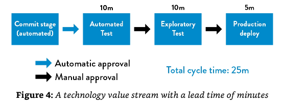
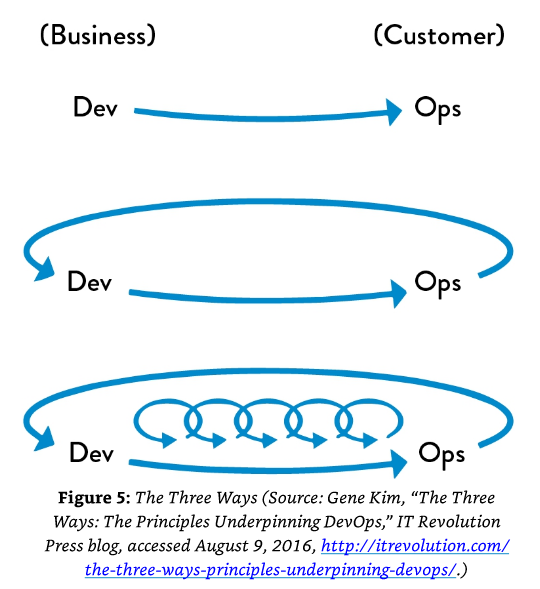
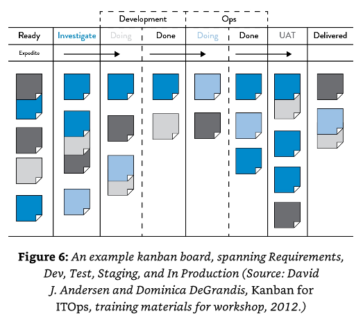
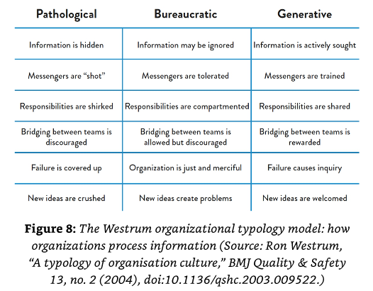

```{r setup, include=FALSE}
knitr::opts_chunk$set(echo = TRUE)
```

## Introduction

This is a precis of Part 1 of The DevOps Handbook (@Kim2016).

## Brief History and Foundations of DevOps

There is an inevitable conflict between Dev and IT Ops. This conflict has been termed "The Core, Chronic Conflict." This is as a result of two potentially conflicting goals within an IT organization: responding to an environment that is constantly evolving (new entrants, new technologies, changing customer trends); and providing stable and reliable services to the customer. The potentially conflicting objectives are magnified when different teams are responsible for each objective separately, accentuating the optimization of local goals at the expense of global goals.

When different teams are pulling at different strings and in different directions, the single building block will stutter to and fro instead of uniformly in a straight path. When this occurs at scale and for mission-critical projects it can lead to human and economic costs which is also referred to as the "Downward Spiral".

The Ethics of DevOps: There is a better way

At the core of DevOps philosophy is that there is always a better way. Several theories and movements inspiring and leading to the development of DevOps were the following:

- 1980's - The Lean Movement
- 2001 - The Agile Manifesto
- 2008 and 2009 - Agile Infrastructure and Velocity Movement. In 2009 term "DevOps" is coined in Belgium at the DevOpsDays conference
- 2009 - The Continuous Delivery Movement using deployment pipelines - @Fitz2009
- 2009 - Toyota Kata, and "improvement kata"

## Part 1 - The Three Ways

Part 1 discusses the themes underpinning DevOps, much of which was built up over decades.

### Agile, Continuous Delivery and the Three Ways

Core to the Lean Movement or Lean Manufacturing was the concept of a _value stream_. In manufacturing this is directly observable. For technology organizations, where value is created sequentially as items of work progress from idea inception, discovery and refinement to user stories and code commits, compilation and eventually solution deployment, this is less directly observable. 

"In DevOps, we typically define our technology value stream as the process required to convert a business hypothesis into a technology-enabled service that delivers value to the customer"

Below is an example of an ideal deployment lead time, measured in minutes.



#### The Three Ways



- The First Way

"The First Way enables fast left-to-right flow of work from Development to Operations to the customer. In order to maximize flow, we need to make work visible, reduce our batch sizes and intervals of work, build in quality by preventing defects from being passed to downstream work centers, and constantly optimize for the global goals."

...

"The resulting practices include continuous build, integration, test, and deployment processes; creating environments on demand; limiting work in process (WIP); and building systems and organizations that are safe to change."

- The Second Way

"The Second Way enables the fast and constant flow of feedback from right to left at all stages of our value stream."

- The Third Way

Continual Learning and Experimentation.

### The First Way: The Principles of Flow

- Make work visible

In manufacturing value streams, the flow of work is directly observable. In the technology value stream, the flow of work and the transition of tasks between states are mostly activated with button clicks. Without having this work visually represented, it would be difficult to know where a given item of work is currently in the value stream, and optimizing for flow will be virtually impossible to do. With some history of work items it also becomes possible to model/predict lead times, especially where items are sized. Examples of interesting forecasting techniques taking into account historic data can be found in @Wester2020 and @Kanbanize.



- Limit Work in Process (WIP)

By setting predefined WIP limits for each column or state, and using a Pull approach to taking on new tasks, if a column is constrained with too many tasks preventing a member of the team from pulling an item of work into a new column or state, it highlights a bottleneck which members of the team, with capacity, can then help to unblock.

Another benefit to visualizing work, and committing to work that is represented on a Kanban board for a particular sprint cycle or length of time (sprints are typically 2 week intervals) is that distractions and multi-tasking or context-switching become less likely. Again, in the technology value stream disruptions and their consequences are often invisible, unlike in the manufacturing value stream where this is more directly observable.

There are several games to demonstrate the impact of context switching. One you could try alone or with a team is documented in @Wells2020. The general idea is to "stop starting, and start finishing." It sounds simple, but after years of experience working with software development teams i can assure you it is not, and requires a process and diligence.

- Reduce Batch Sizes

Batch sizes can be thought of as units of work. When thinking about how small a batch size or unit of work should be represented as, it may help to think in terms of the lowest unit possible which adds value to the end client. In this way, work can commence and be delivered end-to-end. Smaller batch sizes result in lower lead times, quicker defect detection and shorter feedback loops. Reduced batch sizes can also be thought of as "single piece flow" and the benefit of such an approach may extend to more use cases, especially in manufacturing, than one might think. See @Luyten2014 for more on this, with an example and a link to a video in which the experiment is carried out.

- Reduce the Number of Handoffs

In the technology value stream, there could be multiple departments and teams involved. As items are handed off to another team, so context and knowledge are likely degraded and additional queues are added to the flow of work. The best approach to minimizing the number of handoffs is to automate as much of the stream of work as possible, and to structure teams such that there will be less dependencies on other teams. Examples might include building teams with a range of expertise and responsibility, from development to QA, DevOps and Info Security etc.

- Continually Identify and Elevate our Constraints

There are many potential constraints that could "block" the flow of work in a technology value stream. The types of constraints generally encountered in a DevOps framework might include:

1. Environment creation
2. Code deployment
3. Test setup and run
4. Overly tight architecture

Elevating these constraints such that they can be identified and removed should leave the only constraints being the quality of the business objectives and business hypotheses, and the capabilities of the Delivery Team (Dev, QA, Dev/ITOps, InfoSec etc) to deliver on those objectives with software solutions.

- Eliminate Hardships and Waste in the Value Stream

The commonly used definition of "waste" in the Lean Movement is "the use of any material or resource beyond what the customer requires and is willing to pay for." Waste is inevitable without adequately communicated objectives and a common understanding between all stakeholders of what needs to be delivered. This is made more difficult the greater the separation between the Delivery Team and the end client. As such, it is widely encouraged that regular feedback sessions are held with the end customer, which is reinforced by smaller batch sizes and newly available ready-to-release (if not already released) code.

Additional categories of hardships and waste (taken from "Implementing Lean Software Development") might include:

1. *Partially done work* - this work becomes worth less and less as time progresses
2. *Extra processes* - specifically processes that do not add value to the customer
3. *Extra features* - this can be thought of as "scope creep"...and is a commonly observed behavioral bias within Delivery Teams, where with a bit more effort the belief is that more value can be added to the project/product when the additional feature/s were not part of the original business hypothesis/objective.
4. *Task switching* - this will incur the usual delays from context switching as discussed in the section about limiting Work in Process (WIP). Task switching generally comes down to the inefficient allocation of resources and is commonly found in organizations where resources are thinly spread across multiple business objectives, optimizing for multiple local goals instead of a single global goal. I have witnessed first-hand the impacts of this where a single technical lead was managing a single team working on 2 products simultaneously. That is a recipe for hardship and disappointment.
5. *Waiting* - whilst dependencies across teams/departments cannot always be avoided, limiting the number of handoffs will minimize the amount of time spent waiting for dependencies to continue the flow of work.
6. *Motion* - defined as the amount of effort to move information from one work center to another. For remote teams, this is an increased risk. In a post-Covid world, this is something most organizations have had to learn to deal with. Hopefully expediting their abilities to streamline the flow of knowledge between work centers.
7. *Defects* - you can think of defects as bugs or missing information. The longer it takes to identify defects, the longer it takes to solve them. This is why shorter feedback loops are optimal.
8. *Nonstandard or manual work* - typical examples include relying on IT Ops for setting up servers or semi-production environments on which to test new functionality. This is a constraint which should be elevated withing the team and removed where possible, including with the automation of as much of the work as possible.
9. *Heroics* - a double-edged sword in which pulling the proverbial rabbit out of a hat meets client expectations but at what cost? Stakeholders celebrate the milestone, and the hero is congratulated for awesome work. However, this knowledge is less likely to be distributed across the team, there is an increasing key-person risk (and when the key-person exits the organization there is a lasting impact) and the cycle inevitably repeats. Working weekends or putting in all-nighters should be avoided to the furthest extent possible, and their occurrence is an indicator of a bigger problem. Fast flow means consistent throughput whereas heroics implies a bottleneck being unblocked at the 11th hour with extreme effort. It is not sustainable and will likely damage morale over a long enough time horizon.

### The Second Way - The Principles of Feedback

Since technology work typically involves working with complex systems, and because designing perfectly secure systems may be close to impossible, @Spear1999 discusses the four conditions that should make it safer to work in complex systems:

1. Complex work is managed so that problems in design and operations are revealed.
2. Problems are swarmed and solved, resulting in quick construction of knowledge.
3. New local knowledge is exploited globally throughout the organization.
4. Leaders create other leaders who continually grow these types of capabilities.

The first condition requires feedback loops. The simplest example might be unit, integrated or functional tests as well as build checks. But there is a lot more to feedback loops than purely environmental testing.
Either way, smaller deliverable units of work should be simpler to test and have reduced feedback or feed forward cycles, allowing for earlier detection of defects or divergence from product and business objectives.

The second condition may seem counter intuitive, in that it requires global resources to solve a local problem. However, this is critical for the distribution of knowledge and for avoiding the problem in future. This requires the culture of a learning organization with a systems thinking mindset.

### The Third Way: The Principles of Continual Learning and Experimentation

- Enabling Organizational Learning and a Safety Culture

Having been on the proprietary trading desk of an investment bank and having witnessed "fat finger mistakes", or as a product manager for a product used to trade billions of dollars in financial assets i can tell you that learning organizations with a safety culture are in the minority. Production issues typically originate much higher up the value stream, often long before the system sees the light of a production day. All too often resolutions can be inadequate and temporary workarounds, whether they be added manual checks or otherwise, means the symptom is treated instead of the source of the problem. With a safe and organizational culture of learning, issues can be resolved globally and systematically ensuring any kinks in the chain of processes are ironed out in a more sustainable way. To quote Bethany Macri from Etsy: "By removing blame, you remove fear; by removing fear, you enable honesty; and honesty enables prevention." Such organizational cultures lead to happier employees who are more committed and of course ultimately more satisfied customers.

Below is an image of the types of organizational cultures, with the attributes of "Generative" organizations exhibiting that of an organization with a continual learning and safety mindset.



# References
